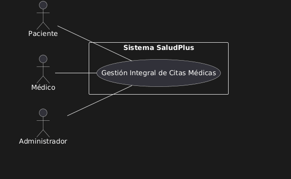
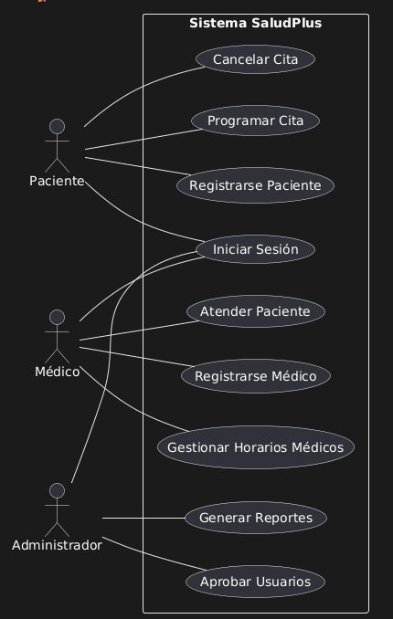
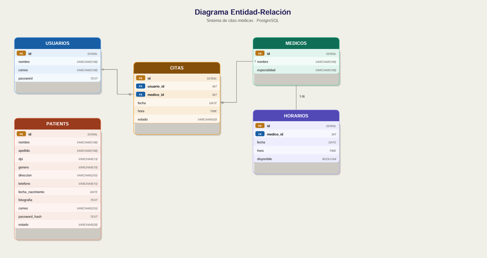

## Proyecto: Plataforma de Gestión de Citas Médicas
### Curso: Análisis y Diseño de Sistemas 1 — Sección B
### Grupo: G1

## Requerimiento Funcional
 
| Campo | Contenido |
|-------|-----------|
| **ID** | RF-001 |
| **Descripción** | El sistema debe permitir al Paciente programar una cita médica con un médico disponible. Para ello, el paciente selecciona al médico desde la página principal, elige una fecha y hora disponible dentro del horario configurado por el médico, e ingresa el motivo de la cita. El sistema valida que: la fecha esté dentro de los días de atención del médico, el horario seleccionado no esté ocupado por otro paciente, el paciente no tenga ya una cita activa con ese mismo médico, y no existan traslapes con otras citas del paciente el mismo día a la misma hora. Si todas las validaciones son exitosas, la cita queda registrada y aparece en la lista de citas activas del paciente y en la agenda del médico. |
| **Actores Involucrados** | Paciente, Sistema SaludPlus, Médico |
 
---
 
## Requerimiento de Restricción
 
| Campo | Contenido |
|-------|-----------|
| **ID** | RF-001 |
| **Descripción** | Todas las contraseñas de usuarios (Pacientes, Médicos y Administrador) deben almacenarse en la base de datos de forma encriptada, utilizando un algoritmo de hash seguro. Bajo ninguna circunstancia se permitirá guardar contraseñas en texto plano. |
| **Justificación** | La plataforma SaludPlus maneja información médica sensible y datos personales de pacientes y médicos. Almacenar contraseñas en texto plano representa un riesgo crítico de seguridad: en caso de una brecha de datos, las credenciales de todos los usuarios quedarían expuestas directamente. El uso de algoritmos de hash con salt garantiza que, incluso si la base de datos es comprometida, las contraseñas no puedan ser recuperadas fácilmente. |
| **Impacto** | El equipo de desarrollo debe implementar la encriptación en el módulo de registro y en el módulo de actualización de perfil para todos los roles. Además, el proceso de autenticación debe comparar la contraseña ingresada contra el hash almacenado, nunca en texto plano. |
 
---
 
## Requerimiento de Calidad — Escenario de Atributo de Calidad (EAC)
 
| Campo | Contenido |
|-------|-----------|
| **ID** | EAC-001 |
| **Atributo de Calidad** | Usabilidad |
| **Escenario crudo** | Un paciente que utiliza la plataforma por primera vez necesita programar una cita médica sin haber recibido capacitación previa, y debe poder completar el proceso de forma autónoma sin cometer errores críticos. |
| **Estímulo** | Un paciente nuevo intenta programar su primera cita médica en SaludPlus: busca un médico por especialidad, consulta su disponibilidad por fecha y completa el formulario de programación de cita. |
| **Fuente del estímulo** | Paciente registrado y aprobado, sin experiencia previa con la plataforma. |
| **Entorno** | Sistema en operación normal, accedido desde un navegador web en desktop o dispositivo móvil. El paciente ya inició sesión correctamente. |
| **Artefacto** | Módulo de programación de citas del Paciente: página principal con listado de médicos, vista de horarios con filtro por fecha, y formulario de programación de cita. |
| **Respuesta esperada** | El flujo de programación de cita debe ser intuitivo y guiado. Los horarios disponibles y ocupados deben distinguirse visualmente de forma clara. Los mensajes de error deben indicar con precisión el motivo por el cual no se puede confirmar la cita. El paciente no debe necesitar ayuda externa para completar el proceso. |
| **Medida de la respuesta** | Al menos el 90% de los pacientes nuevos debe ser capaz de completar exitosamente el proceso de programación de cita en un tiempo máximo de 3 minutos, sin cometer más de 1 error de navegación y sin requerir asistencia externa. |
| **Objetivo de negocio** | Reducir la fricción en el proceso de reserva de citas para maximizar la adopción de la plataforma por parte de los pacientes y disminuir la carga de atención telefónica en las clínicas. |
 

---

#  Sistema SaludPlus

## 1. Diagrama del Core

Este diagrama muestra un único proceso central (óvalo) que representa el sistema completo y los actores del negocio conectados a él.

### Actores del Sistema

| Actor | Descripción |
|-------|-------------|
| **Paciente** | Usuario que utiliza la plataforma para registrarse, buscar médicos disponibles, consultar horarios y programar citas médicas. |
| **Médico** | Profesional de salud que utiliza el sistema para gestionar su agenda, definir horarios disponibles y atender pacientes mediante citas programadas. |
| **Administrador** | Usuario encargado de supervisar el sistema, aprobar registros de usuarios, administrar cuentas y generar reportes del funcionamiento del sistema. |

---

## Descripción Formal del Core

El sistema **SaludPlus** es una plataforma diseñada para gestionar el proceso de programación y administración de citas médicas entre pacientes y médicos dentro de una clínica. 

- **Para pacientes**: Permite registrarse, iniciar sesión, consultar médicos disponibles y programar citas médicas según los horarios establecidos por los médicos.
- **Para médicos**: Pueden gestionar sus horarios de atención y registrar la atención brindada a los pacientes durante las citas programadas.
- **Para administrador**: Supervisa el funcionamiento general de la plataforma, aprobando usuarios registrados, administrando cuentas y generando reportes sobre el uso del sistema.

> **Valor principal del sistema**: Mejorar la eficiencia en la gestión de citas médicas, facilitar la organización de horarios y mejorar la comunicación entre pacientes, médicos y la administración de la clínica.

---

## Diagrama de Primera Descomposición

### Descripción de los Procesos del Negocio

#### Registrarse Paciente
- **Descripción**: Permite a un paciente crear una cuenta dentro del sistema proporcionando sus datos personales para poder acceder a los servicios de la plataforma.
- **Actores**: Paciente

#### Registrarse Médico
- **Descripción**: Permite a un médico registrarse en el sistema proporcionando su información personal y profesional para poder ofrecer consultas médicas dentro de la plataforma.
- **Actores**: Médico

#### Iniciar Sesión
- **Descripción**: Proceso mediante el cual los usuarios registrados acceden al sistema utilizando su correo electrónico y contraseña.
- **Actores**: Paciente, Médico, Administrador

#### Programar Cita
- **Descripción**: Permite al paciente seleccionar un médico disponible y reservar una cita médica según los horarios disponibles.
- **Actores**: Paciente

#### Cancelar Cita
- **Descripción**: Permite al paciente cancelar una cita previamente programada dentro del sistema.
- **Actores**: Paciente

#### Atender Paciente
- **Descripción**: Permite al médico registrar la atención brindada a un paciente durante una cita médica programada.
- **Actores**: Médico

#### Gestionar Horarios Médicos
- **Descripción**: Permite al médico definir y administrar los horarios en los que estará disponible para atender pacientes.
- **Actores**: Médico

#### Aprobar Usuarios
- **Descripción**: Permite al administrador revisar y aprobar los registros de médicos y pacientes en el sistema.
- **Actores**: Administrador

#### Generar Reportes
- **Descripción**: Permite al administrador generar reportes relacionados con citas médicas, usuarios registrados y uso del sistema.
- **Actores**: Administrador

---

## Documentación de Casos de Uso

### CDU 1 — Registrarse Paciente
| Campo | Detalle |
|-------|---------|
| **Nombre** | Registrarse Paciente |
| **Actor principal** | Paciente |
| **Descripción** | Permite a un paciente crear una cuenta en el sistema proporcionando sus datos personales para poder acceder a la plataforma y solicitar citas médicas. |
| **Precondiciones** | • El paciente no debe estar registrado previamente. |
| **Flujo principal** | 1. El paciente accede a la opción registrarse. 2. Ingresa sus datos personales. 3. El sistema valida la información. 4. El sistema guarda la información del paciente. 5. El sistema confirma el registro. |
| **Postcondición** | • El paciente queda registrado en el sistema con estado pendiente o activo. |

---

### CDU 2 — Registrarse Médico
| Campo | Detalle |
|-------|---------|
| **Actor principal** | Médico |
| **Descripción** | Permite a un médico registrarse en la plataforma proporcionando su información personal y profesional para ofrecer servicios médicos. |
| **Precondiciones** | • El médico no debe estar registrado. |
| **Flujo principal** | 1. El médico accede a la opción de registro. 2. Ingresa información personal y profesional. 3. El sistema valida los datos. 4. El sistema guarda la información. 5. El registro queda pendiente de aprobación. |
| **Postcondición** | • El médico queda registrado con estado pendiente. |

---

### CDU 3 — Iniciar Sesión
| Campo | Detalle |
|-------|---------|
| **Actores** | • Paciente • Médico • Administrador |
| **Descripción** | Permite a los usuarios acceder al sistema mediante sus credenciales registradas. |
| **Precondiciones** | • El usuario debe estar registrado. |
| **Flujo principal** | 1. El usuario ingresa correo y contraseña. 2. El sistema valida las credenciales. 3. El sistema verifica el estado del usuario. 4. El sistema permite el acceso. |
| **Postcondición** | • El usuario accede al sistema. |

---

### CDU 4 — Programar Cita
| Campo | Detalle |
|-------|---------|
| **Actor principal** | Paciente |
| **Descripción** | Permite al paciente seleccionar un médico disponible y programar una cita médica según los horarios disponibles. |
| **Precondiciones** | • El paciente debe estar autenticado. • El médico debe tener horarios disponibles. |
| **Flujo principal** | 1. El paciente busca médicos disponibles. 2. Selecciona un médico. 3. El sistema muestra horarios disponibles. 4. El paciente selecciona un horario. 5. El sistema registra la cita. |
| **Postcondición** | • La cita queda registrada en el sistema. |

---

### CDU 5 — Cancelar Cita
| Campo | Detalle |
|-------|---------|
| **Actor principal** | Paciente |
| **Descripción** | Permite al paciente cancelar una cita previamente programada. |
| **Precondiciones** | • La cita debe existir. |
| **Flujo principal** | 1. El paciente visualiza sus citas. 2. Selecciona la cita. 3. Selecciona cancelar. 4. El sistema actualiza el estado de la cita. |
| **Postcondición** | • La cita queda cancelada. |

---

### CDU 6 — Atender Paciente
| Campo | Detalle |
|-------|---------|
| **Actor principal** | Médico |
| **Descripción** | Permite al médico registrar la atención médica realizada durante una cita programada. |
| **Precondiciones** | • Debe existir una cita programada. |
| **Flujo principal** | 1. El médico visualiza sus citas del día. 2. Selecciona una cita. 3. Registra diagnóstico o tratamiento. 4. El sistema guarda la información. |
| **Postcondición** | • La atención queda registrada. |

---

### CDU 7 — Gestionar Horarios Médicos
| Campo | Detalle |
|-------|---------|
| **Actor principal** | Médico |
| **Descripción** | Permite al médico definir los horarios en los que estará disponible para atender pacientes. |
| **Precondiciones** | • El médico debe estar autenticado. |
| **Flujo principal** | 1. El médico accede a gestión de horarios. 2. Define días y horas disponibles. 3. El sistema guarda la información. |
| **Postcondición** | • Los horarios quedan disponibles para los pacientes. |

---

### CDU 8 — Aprobar Usuarios
| Campo | Detalle |
|-------|---------|
| **Actor principal** | Administrador |
| **Descripción** | Permite al administrador aprobar o rechazar registros de médicos y pacientes. |
| **Precondiciones** | • Debe existir un usuario pendiente. |
| **Flujo principal** | 1. El administrador visualiza usuarios pendientes. 2. Revisa la información. 3. Aprueba o rechaza el usuario. 4. El sistema actualiza el estado. |
| **Postcondición** | • El usuario queda activo o rechazado. |

---

### CDU 9 — Generar Reportes
| Campo | Detalle |
|-------|---------|
| **Actor principal** | Administrador |
| **Descripción** | Permite al administrador generar reportes del uso del sistema, como número de citas, médicos registrados y pacientes activos. |
| **Precondiciones** | • El administrador debe estar autenticado. |
| **Flujo principal** | 1. El administrador accede al módulo de reportes. 2. Selecciona el tipo de reporte. 3. El sistema genera el reporte. |
| **Postcondición** | • El reporte se muestra o se descarga. |

---

## Historias de Usuario

---

## HU-001 — Registro de Paciente

| Campo | Detalle |
|-------|---------|
| **ID** | HU-001 |
| **Nombre** | Registro de Paciente |
| **Sprint** | Sprint 1 |
| **Prioridad** | Alta |
| **Story Points** | 5 |

**Historia:**
> Como paciente, quiero registrarme en la plataforma SaludPlus proporcionando mis datos personales, para poder acceder a los servicios de gestión de citas médicas.

**Criterios de Aceptación:**
- El formulario debe incluir: nombre, apellido, DPI, género, dirección, teléfono, fecha de nacimiento, fotografía (opcional), correo electrónico y contraseña.
- La contraseña debe tener mínimo 8 caracteres, al menos una letra mayúscula, una minúscula y un número.
- El sistema debe validar que el correo electrónico no esté duplicado.
- La contraseña debe almacenarse encriptada en la base de datos.
- Todos los campos obligatorios deben ser validados antes de enviar el formulario.
- Al completar el registro, el paciente queda en estado "Pendiente de aprobación".
- Se debe mostrar un mensaje de confirmación al finalizar el registro.

---

## HU-002 — Registro de Médico

| Campo | Detalle |
|-------|---------|
| **ID** | HU-002 |
| **Nombre** | Registro de Médico |
| **Sprint** | Sprint 1 |
| **Prioridad** | Alta |
| **Story Points** | 5 |

**Historia:**
> Como médico, quiero registrarme en la plataforma proporcionando mi información personal y profesional, para poder ofrecer mis servicios de consulta médica a través de SaludPlus.

**Criterios de Aceptación:**
- El formulario debe incluir: nombre, apellido, DPI, fecha de nacimiento, género, dirección, teléfono, fotografía (obligatoria), número colegiado, especialidad, dirección de clínica, correo electrónico y contraseña.
- La fotografía es obligatoria; no se permite el registro sin ella.
- El número colegiado debe ser único en el sistema.
- La contraseña debe cumplir los mismos requisitos que el registro de paciente.
- La contraseña debe almacenarse encriptada en la base de datos.
- Al completar el registro, el médico queda en estado "Pendiente de aprobación".
- Se debe mostrar un mensaje de confirmación al finalizar el registro.

---

## HU-003 — Login Paciente/Médico

| Campo | Detalle |
|-------|---------|
| **ID** | HU-003 |
| **Nombre** | Login Paciente/Médico |
| **Sprint** | Sprint 1 |
| **Prioridad** | Alta |
| **Story Points** | 3 |

**Historia:**
> Como paciente o médico registrado, quiero iniciar sesión en la plataforma con mi correo y contraseña, para poder acceder a las funcionalidades según mi rol.

**Criterios de Aceptación:**
- El sistema debe autenticar al usuario con correo electrónico y contraseña.
- El sistema debe verificar que el usuario haya sido aprobado por el administrador antes de permitir el acceso.
- Si el usuario está pendiente de aprobación, se debe mostrar el mensaje: "Su cuenta está pendiente de aprobación".
- Si las credenciales son incorrectas, se debe mostrar un mensaje de error específico.
- Si la cuenta está dada de baja, se debe mostrar un mensaje indicándolo.
- Debe existir un enlace visible para registrarse si el usuario no tiene cuenta.
- Al iniciar sesión exitosamente, el usuario es redirigido al dashboard correspondiente a su rol.

---

## HU-004 — Login Administrador (2FA)

| Campo | Detalle |
|-------|---------|
| **ID** | HU-004 |
| **Nombre** | Login Administrador con Autenticación de Dos Factores |
| **Sprint** | Sprint 1 |
| **Prioridad** | Alta |
| **Story Points** | 8 |

**Historia:**
> Como administrador, quiero iniciar sesión con un proceso de autenticación de dos factores, para garantizar la seguridad del acceso al panel de administración de SaludPlus.

**Criterios de Aceptación:**
- La primera fase consiste en ingresar usuario y contraseña predeterminados almacenados encriptados en la base de datos.
- Al pasar la primera fase, el administrador es redirigido a una página de segunda autenticación.
- La segunda fase consiste en subir un archivo llamado exactamente "auth2-ayd1.txt" que contiene una contraseña encriptada.
- El sistema debe validar el nombre exacto del archivo y el contenido de la contraseña encriptada.
- La contraseña de la primera fase y la del archivo deben ser diferentes entre sí.
- Solo si ambas fases son exitosas se permite el acceso al panel de administración.
- Si alguna fase falla, se muestra un mensaje de error claro.

---

## HU-005 — Aceptar/Rechazar Usuarios

| Campo | Detalle |
|-------|---------|
| **ID** | HU-005 |
| **Nombre** | Aceptar o Rechazar Usuarios |
| **Sprint** | Sprint 1 |
| **Prioridad** | Alta |
| **Story Points** | 5 |

**Historia:**
> Como administrador, quiero revisar y aprobar o rechazar los registros de pacientes y médicos, para controlar quién puede acceder a la plataforma SaludPlus.

**Criterios de Aceptación:**
- El administrador visualiza listas separadas de pacientes y médicos pendientes de aprobación.
- Para pacientes se muestra: fotografía (o imagen por defecto si no tiene), nombre completo, DPI, género, fecha de nacimiento y correo electrónico.
- Para médicos se muestra además: especialidad y número de colegiado.
- Cada registro tiene botones claros de "Aceptar" y "Rechazar".
- Al aceptar, el usuario cambia a estado "Aprobado" y puede iniciar sesión.
- Al rechazar, el usuario cambia a estado "Rechazado" y no puede iniciar sesión.
- Los cambios de estado deben guardarse correctamente en la base de datos.

---

## HU-006 — Ver Pacientes Activos

| Campo | Detalle |
|-------|---------|
| **ID** | HU-006 |
| **Nombre** | Ver Pacientes y Médicos Activos |
| **Sprint** | Sprint 1 |
| **Prioridad** | Media |
| **Story Points** | 3 |

**Historia:**
> Como administrador, quiero visualizar la lista de pacientes y médicos aprobados en el sistema, para tener control y supervisión de los usuarios activos en la plataforma.

**Criterios de Aceptación:**
- Se muestran listas separadas de pacientes y médicos aprobados con su información completa.
- Cada registro incluye una opción funcional de "Dar de baja".
- Al dar de baja, el sistema solicita confirmación antes de ejecutar la acción.
- Al confirmar, el usuario cambia a estado "Inactivo" o "Dado de baja".
- Los usuarios dados de baja no pueden iniciar sesión posteriormente.
- Los cambios de estado se guardan correctamente en la base de datos.

---

## HU-007 — Gestión de Citas del Paciente

| Campo | Detalle |
|-------|---------|
| **ID** | HU-007 |
| **Nombre** | Gestión de Citas del Paciente |
| **Sprint** | Sprint 2 |
| **Prioridad** | Alta |
| **Story Points** | 8 |

**Historia:**
> Como paciente, quiero poder programar citas médicas con los médicos disponibles en la plataforma, para recibir atención médica de forma organizada y eficiente.

**Criterios de Aceptación:**
- El paciente puede seleccionar un médico, una fecha y hora disponible, e ingresar el motivo de la cita.
- El sistema valida que la fecha esté dentro de los días de atención del médico.
- El sistema valida que el horario seleccionado esté disponible.
- El sistema valida que el paciente no tenga otra cita activa con el mismo médico.
- El sistema valida que no existan traslapes con otras citas del paciente el mismo día a la misma hora.
- Si una validación falla, se muestra un mensaje de error específico indicando el motivo.
- Un paciente puede tener citas activas con diferentes médicos simultáneamente.
- La cita queda registrada y aparece en la lista de citas activas del paciente y en la agenda del médico.

---

## HU-008 — Atender Paciente

| Campo | Detalle |
|-------|---------|
| **ID** | HU-008 |
| **Nombre** | Atender Paciente |
| **Sprint** | Sprint 2 |
| **Prioridad** | Alta |
| **Story Points** | 5 |

**Historia:**
> Como médico, quiero poder marcar una cita como atendida e ingresar el tratamiento correspondiente, para llevar un registro de la atención brindada a cada paciente.

**Criterios de Aceptación:**
- El médico visualiza todas sus citas pendientes ordenadas por fecha más próxima.
- Existe un botón claro para marcar una cita como "Atendida".
- Al presionar el botón se despliega un formulario donde el médico ingresa el tratamiento.
- El campo de tratamiento es obligatorio; no se puede guardar vacío.
- Al confirmar, la cita cambia su estado a "Atendida" y desaparece de la lista de pendientes.
- El tratamiento queda registrado y es visible para el paciente en su historial de citas.

---

## HU-009 — Cancelación de Cita y Notificar al Paciente

| Campo | Detalle |
|-------|---------|
| **ID** | HU-009 |
| **Nombre** | Cancelación de Cita y Notificación al Paciente |
| **Sprint** | Sprint 2 |
| **Prioridad** | Alta |
| **Story Points** | 5 |

**Historia:**
> Como médico, quiero poder cancelar una cita de un paciente y notificarle automáticamente por correo electrónico, para mantener una comunicación efectiva cuando surjan imprevistos.

**Criterios de Aceptación:**
- El médico puede cancelar una cita desde la lista de pendientes con un botón claro.
- El sistema solicita confirmación antes de cancelar.
- Al confirmar, la cita cambia su estado a "Cancelada por el médico" y desaparece de pendientes.
- El horario de la cita cancelada queda disponible para otros pacientes.
- El sistema envía automáticamente un correo electrónico al paciente con: fecha de cita cancelada, hora, motivo de la cita, nombre del médico y mensaje de disculpa.
- El correo debe llegar exitosamente al paciente.

---

## HU-010 — Establecer Horarios y Actualizarlos

| Campo | Detalle |
|-------|---------|
| **ID** | HU-010 |
| **Nombre** | Establecer y Actualizar Horarios del Médico |
| **Sprint** | Sprint 2 |
| **Prioridad** | Alta |
| **Story Points** | 5 |

**Historia:**
> Como médico, quiero establecer y actualizar mis horarios de atención, para que los pacientes puedan consultar mi disponibilidad y programar citas dentro de mis horas de trabajo.

**Criterios de Aceptación:**
- El médico puede seleccionar los días que atenderá mediante checkboxes o selector múltiple.
- El médico puede definir el horario de inicio y fin de atención.
- El horario seleccionado aplica igual para todos los días elegidos.
- Los horarios se guardan correctamente y se reflejan en la disponibilidad visible para los pacientes.
- El médico puede modificar posteriormente sus días y horarios.
- Al actualizar horarios, el sistema valida que no existan citas activas fuera del nuevo rango horario.
- Si existen conflictos, el sistema bloquea la actualización y muestra un mensaje claro indicando que debe reprogramar o cancelar esas citas primero.

---

## HU-011 — Historial de Citas

| Campo | Detalle |
|-------|---------|
| **ID** | HU-011 |
| **Nombre** | Historial de Citas del Médico |
| **Sprint** | Sprint 2 |
| **Prioridad** | Media |
| **Story Points** | 3 |

**Historia:**
> Como médico, quiero visualizar el historial de todas mis citas pasadas, para llevar un control de los pacientes que he atendido y el estado de cada consulta.

**Criterios de Aceptación:**
- Se muestran todas las citas pasadas: atendidas, canceladas por el médico y canceladas por el paciente.
- La información mínima mostrada es: fecha, hora, nombre del paciente y estado de la cita.
- Los tres estados se distinguen visualmente con colores o íconos diferentes.
- La información está organizada cronológicamente, con las más recientes primero.

---

## HU-012 — Mostrar Médicos y Búsqueda

| Campo | Detalle |
|-------|---------|
| **ID** | HU-012 |
| **Nombre** | Mostrar Médicos y Búsqueda por Especialidad |
| **Sprint** | Sprint 2 |
| **Prioridad** | Alta |
| **Story Points** | 3 |

**Historia:**
> Como paciente, quiero ver la lista de médicos disponibles y filtrarlos por especialidad, para encontrar fácilmente al médico que necesito según mi condición médica.

**Criterios de Aceptación:**
- La página principal muestra todos los médicos registrados y aprobados.
- Se excluyen los médicos con los que el paciente ya tiene una cita activa.
- La información mínima mostrada de cada médico es: nombre completo, especialidad, dirección de clínica y fotografía.
- El paciente puede buscar médicos por especialidad mediante un campo de texto con botón o un ComboBox/dropdown.
- La búsqueda muestra solo los médicos de la especialidad seleccionada con la misma información que la página principal.
- La interfaz es clara, organizada y responsive.

---

## HU-013 — Mostrar Horarios y Programar Cita

| Campo | Detalle |
|-------|---------|
| **ID** | HU-013 |
| **Nombre** | Mostrar Horarios del Médico y Programar Cita |
| **Sprint** | Sprint 2 |
| **Prioridad** | Alta |
| **Story Points** | 5 |

**Historia:**
> Como paciente, quiero consultar los horarios disponibles de un médico y programar una cita, para reservar una consulta en el momento que mejor se adapte a mi disponibilidad.

**Criterios de Aceptación:**
- Al seleccionar un médico se muestran sus días de atención y horario general.
- El sistema permite filtrar por fecha específica mostrando los horarios ocupados y disponibles con indicadores visuales claros.
- Si el médico no atiende en la fecha seleccionada, se muestra un mensaje apropiado.
- El paciente puede programar una cita ingresando: fecha, hora y motivo de la cita.
- Se aplican todas las validaciones de traslape y disponibilidad requeridas.

---

## HU-014 — Visualizar y Gestionar Citas Activas

| Campo | Detalle |
|-------|---------|
| **ID** | HU-014 |
| **Nombre** | Visualizar y Gestionar Citas Activas del Paciente |
| **Sprint** | Sprint 2 |
| **Prioridad** | Alta |
| **Story Points** | 3 |

**Historia:**
> Como paciente, quiero visualizar mis citas activas y poder cancelarlas si es necesario, para gestionar mi agenda médica de forma autónoma.

**Criterios de Aceptación:**
- Se muestran todas las citas pendientes de atención con: fecha, hora, nombre del médico, dirección de la clínica y motivo de la cita.
- Solo se muestran citas que no han sido atendidas ni canceladas.
- El paciente puede cancelar una cita desde esta vista.
- Al cancelar, el sistema solicita confirmación mediante un modal o diálogo.
- Al confirmar, la cita cambia su estado a "Cancelada por el paciente" y se elimina de la lista de citas activas.
- El horario de la cita cancelada queda disponible para otros pacientes.

---

## HU-015 — Historial de Citas Paciente

| Campo | Detalle |
|-------|---------|
| **ID** | HU-015 |
| **Nombre** | Historial de Citas del Paciente |
| **Sprint** | Sprint 2 |
| **Prioridad** | Media |
| **Story Points** | 3 |

**Historia:**
> Como paciente, quiero visualizar el historial de todas mis citas pasadas con su estado y tratamiento, para llevar un control de mis consultas médicas realizadas.

**Criterios de Aceptación:**
- Se muestran todas las citas pasadas: atendidas y canceladas (por el paciente o por el médico).
- La información mínima mostrada es: fecha, nombre del médico, dirección de la clínica, motivo, tratamiento (solo si la cita fue atendida) y estado de la cita.
- Los estados se distinguen claramente con etiquetas: "Atendido", "Cancelada por paciente", "Cancelada por médico".
- Se usan colores o íconos para distinguir visualmente los diferentes estados.
- La información está organizada cronológicamente.

---

## HU-016 — Actualización de Datos Paciente/Médico

| Campo | Detalle |
|-------|---------|
| **ID** | HU-016 |
| **Nombre** | Ver y Actualizar Perfil de Paciente y Médico |
| **Sprint** | Sprint 2 |
| **Prioridad** | Media |
| **Story Points** | 3 |

**Historia:**
> Como paciente o médico, quiero poder visualizar y actualizar los datos de mi perfil, para mantener mi información personal y profesional actualizada en la plataforma.

**Criterios de Aceptación:**
- El usuario puede visualizar todos sus datos registrados en una interfaz clara.
- Puede modificar cualquier campo excepto el correo electrónico (bloqueado o no editable).
- Las validaciones funcionan correctamente en las actualizaciones (formato de contraseña, teléfono, DPI, etc.).
- Si se actualiza la contraseña, se encripta antes de guardar.
- Los cambios se guardan correctamente en la base de datos.
- El médico puede además actualizar sus datos profesionales (especialidad, número colegiado, dirección de clínica).

---

## HU-017 — Visualizar Médicos/Pacientes (Admin)

| Campo | Detalle |
|-------|---------|
| **ID** | HU-017 |
| **Nombre** | Visualizar y Dar de Baja Usuarios (Administrador) |
| **Sprint** | Sprint 2 |
| **Prioridad** | Media |
| **Story Points** | 5 |

**Historia:**
> Como administrador, quiero visualizar la lista completa de médicos y pacientes aprobados y poder darlos de baja, para mantener el control y supervisión de los usuarios activos en la plataforma.

**Criterios de Aceptación:**
- Se muestran listas separadas de pacientes y médicos aprobados con información completa.
- Cada registro incluye una opción funcional y clara de "Dar de baja".
- Al dar de baja, el sistema solicita confirmación antes de ejecutar la acción.
- Al confirmar, el usuario cambia a estado "Inactivo" o "Dado de baja".
- Los usuarios dados de baja no pueden iniciar sesión posteriormente.
- Los cambios de estado se guardan correctamente en la base de datos.

---

## HU-018 — Generar Reporte

| Campo | Detalle |
|-------|---------|
| **ID** | HU-018 |
| **Nombre** | Generar Reportes (Administrador) |
| **Sprint** | Sprint 2 |
| **Prioridad** | Media |
| **Story Points** | 5 |

**Historia:**
> Como administrador, quiero generar reportes analíticos sobre el uso de la plataforma, para tomar decisiones estratégicas basadas en datos reales del sistema.

**Criterios de Aceptación:**
- El sistema genera al menos 2 reportes analíticos diferentes con información relevante.
- Reporte 1: Médicos que más pacientes han atendido, con gráfico de barras y números.
- Reporte 2: Especialidad que más citas ha generado, con gráfico circular y porcentajes.
- Los reportes son visuales (incluyen gráficos, tablas o charts).
- Los datos son precisos y actualizados desde la base de datos.
- La presentación es profesional y útil para la toma de decisiones.

---

## HU-019 — Configuración Docker

| Campo | Detalle |
|-------|---------|
| **ID** | HU-019 |
| **Nombre** | Configuración Docker |
| **Sprint** | Sprint 1 |
| **Prioridad** | Alta |
| **Story Points** | 5 |

**Historia:**
> Como equipo de desarrollo, queremos contenedorizar la aplicación con Docker, para garantizar consistencia entre entornos de desarrollo y producción y simplificar el despliegue.

**Criterios de Aceptación:**
- El frontend está contenedorizado con Docker e incluye un Dockerfile bien configurado.
- El backend está contenedorizado con Docker e incluye un Dockerfile bien configurado.
- Existe un archivo docker-compose.yml funcional que levanta frontend, backend y base de datos.
- La aplicación completa puede levantarse ejecutando `docker-compose up` sin errores.
- Todos los contenedores se comunican correctamente entre sí.
- La aplicación es completamente funcional en el entorno local dockerizado.
- Existe documentación clara de cómo levantar la aplicación con Docker.

---

## Resumen del Product Backlog

| ID | Historia | Sprint | Prioridad | Story Points |
|----|----------|--------|-----------|--------------|
| HU-001 | Registro de Paciente | Sprint 1 | Alta | 5 |
| HU-002 | Registro de Médico | Sprint 1 | Alta | 5 |
| HU-003 | Login Paciente/Médico | Sprint 1 | Alta | 3 |
| HU-004 | Login Administrador (2FA) | Sprint 1 | Alta | 8 |
| HU-005 | Aceptar/Rechazar Usuarios | Sprint 1 | Alta | 5 |
| HU-006 | Ver Pacientes Activos | Sprint 1 | Media | 3 |
| HU-019 | Configuración Docker | Sprint 1 | Alta | 5 |
| HU-007 | Gestión de Citas del Paciente | Sprint 2 | Alta | 8 |
| HU-008 | Atender Paciente | Sprint 2 | Alta | 5 |
| HU-009 | Cancelación de Cita y Notificar al Paciente | Sprint 2 | Alta | 5 |
| HU-010 | Establecer Horarios y Actualizarlos | Sprint 2 | Alta | 5 |
| HU-011 | Historial de Citas del Médico | Sprint 2 | Media | 3 |
| HU-012 | Mostrar Médicos y Búsqueda | Sprint 2 | Alta | 3 |
| HU-013 | Mostrar Horarios y Programar Cita | Sprint 2 | Alta | 5 |
| HU-014 | Visualizar y Gestionar Citas Activas | Sprint 2 | Alta | 3 |
| HU-015 | Historial de Citas Paciente | Sprint 2 | Media | 3 |
| HU-016 | Actualización de Datos Paciente/Médico | Sprint 2 | Media | 3 |
| HU-017 | Visualizar Médicos/Pacientes (Admin) | Sprint 2 | Media | 5 |
| HU-018 | Generar Reporte | Sprint 2 | Media | 5 |
| **Total** | | | | **93 Story Points** |

---

#Diagrama Entidad-Relación

---

Tablero Kanban

Inicio de proyecto:

Durante el proyecto:

Finalización del proyecto:

